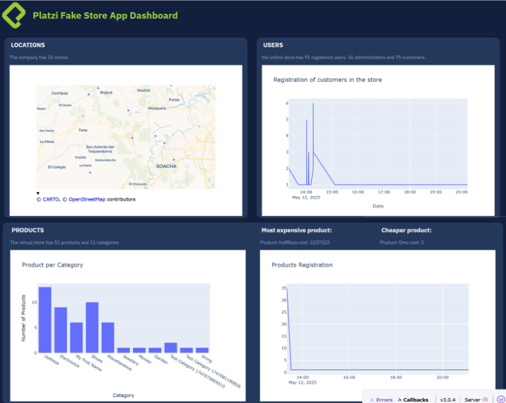

# 🛒 Online Store Dashboard

## 📌 Project Description

This project is a Python dashboard that connects to the [Platzi Fake Store API](https://api.escuelajs.co) to retrieve and visualize e-commerce data. It was developed as a final project for the ReDI School Spring 2025 program.

The goal is to practice:
- API connection and data retrieval
- Object-Oriented Programming (OOP)
- Interactive data visualization

🔧 **Technologies Used:**
- **Python 3.12**
- **FastAPI** – to define and test API endpoints
- **httpx** – to fetch and save external data
- **Dash** & **Plotly** – for building the dashboard interface
- **Pandas** – for data processing and structuring
- **JSON** – to store and read API data

---

## 🖼️ Demo
Here’s a preview of the dashboard in action:



---

## 📁 Project Structure
final_project_spring_2025/
├── api.py # API connection logic
├── components.py # Reusable dashboard components
├── dash_app.py # Main Dash app entry point
├── data.py # Data loading and processing
├── requirements.txt # Project dependencies
├── assets/
│ └── dashboard_screenshot.png # Dashboard screenshot for README
├── data/
│ ├── products.json # Retrieved product data
│ ├── users.json # Retrieved user data
│ └── locations.json # Retrieved location data

--- 

## 📦 Requirements

- Python 3.12+
- All required Python packages are listed in `requirements.txt`

To install them, run:

```bash
pip install -r requirements.txt

---

## ⚙️ Installation

To install and run this project:
1. Clone the repository using `git clone https://github.com/Leonel-M/final_project_spring_2025.git` and navigate into the folder with `cd final_project_spring_2025`.
2. (Optional) Create a virtual environment with `python -m venv venv`, then activate it. On Windows, use `venv\Scripts\activate`; on macOS/Linux, use `source venv/bin/activate`.
3. Install the required dependencies by running `pip install -r requirements.txt`.
4. Launch the dashboard with `python dash_app.py` and open your browser at `http://127.0.0.1:8050`.

---

## 🧪 How to Use
Once the app is running (python dash_app.py), follow these steps:
Open your browser and go to http://127.0.0.1:8050

Explore the dashboard features:
- View product prices and categories
- See user types and registration timelines
- Visualize store locations on a map

---

##🚀 Features
- Connects to the Platzi Fake Store API and retrieves product, user, and location data
- Saves data in JSON format for local processing
- Uses Object-Oriented Programming (OOP) for data encapsulation and modularity
- Displays interactive graphs using Dash and Plotly
- Shows user roles and join dates
- Visualizes store locations on a map

---

##🧩 Challenges & What I Learned
- No prior experience connecting to external APIs
  - Learned to use httpx and FastAPI to fetch and save data.

- Too much logic in one file made the code hard to manage
  - Applied Object-Oriented Programming (OOP) and separated the logic into reusable modules.

- Managing multiple data sources
  - Organized data retrieval and storage using separate JSON files and classes.

---

##🔮 Future Improvements
- Add filters to the dashboard (by price, category, registration date)
- Include sales data to analyze revenue and customer behavior
- Connect to additional APIs for broader product and user insights
- Apply machine learning to predict popular product categories
- Implement real-time updates and live monitoring

---

🙋‍♂️ Author
Leonel Márquez
Python & Data Enthusiast
[[LinkedIn](https://www.linkedin.com/in/leonel-marquez-sanchez/)
